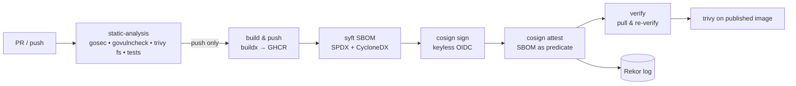

# secure-supply-chain 🛰️

A reference CI/CD pipeline that proves **what** went into the image and **who** built it — and refuses to deploy anything else.

[](https://github.com/mohidev-tech/secure-supply-chain/actions/workflows/release.yml)
[](LICENSE)

## What this proves

| Capability | How |
|---|---|
| **SAST** | gosec on Go source, results uploaded as SARIF to GitHub Security |
| **SCA** | govulncheck on Go modules; Trivy filesystem scan fails on CRITICAL/HIGH |
| **Hardened image** | Distroless nonroot, static binary, `-trimpath`, multi-stage |
| **SBOM generated** | syft in SPDX + CycloneDX, attached to the image as a signed attestation |
| **Image signed** | cosign keyless — signature pinned to *this workflow at this commit*, recorded in Rekor |
| **Self-verifies** | The pipeline's last job pulls what it just pushed and runs the same `cosign verify` an admission controller would |
| **Admission verifies** | Kyverno `ClusterPolicy` rejects unsigned images and images without SBOM attestation (sigstore policy-controller variant also included) |
| **Trivy on the published image** | Final job re-scans the image at the digest — catches anything that snuck through layer caching |

## Pipeline shape



## Quickstart — verify our published image

```bash
./scripts/verify.sh ghcr.io/mohidev-tech/secure-supply-chain-app:main
```

This runs the exact `cosign verify` the cluster admission controller runs. If the output names the workflow path + issuer, you have cryptographic proof of provenance — no key trust required, signature is bound to GitHub's OIDC token at build time.

## Quickstart — see admission deny an unsigned image

On any kind/EKS cluster:

```bash
bash scripts/demo.sh
```

The demo installs Kyverno, applies the policy, tries to deploy `nginx` (unsigned — denied), then deploys the signed app (admitted). One script, the whole story.

## Repo layout

```
app/                            Tiny Go service. The point of the repo is around it
  cmd/app/main.go               Two endpoints, build-time vars injected via -ldflags
  Dockerfile                    Distroless, nonroot, COMMIT/TAG via build-args
.github/workflows/
  release.yml                   The centerpiece — SAST → build → SBOM → sign → attest → verify
deploy/
  helm/app/                     Helm chart that pins image by DIGEST, not tag
  policy/
    kyverno-verify-signatures.yaml      Kyverno verifyImages policy (default)
    sigstore-policy-controller.yaml     Sigstore policy-controller alternative
scripts/
  verify.sh                     What admission does — for humans
  download-sbom.sh              Decode the SBOM attestation
  demo.sh                       Full positive + negative path against a real cluster
docs/
  slsa-mapping.md               Which SLSA requirements are met and how
  adr/0001-keyless-cosign-over-static-keys.md
```

## How this slots into the portfolio

[devsecops-platform](https://github.com/mohidev-tech/devsecops-platform) has a Kyverno `trusted-registry` policy that says "images must come from `ghcr.io/mohidev-tech/*`." This repo is what makes that constraint *meaningful* — the registry path is populated only by this pipeline, every image is signed against a known workflow identity, and every image carries a verifiable SBOM. The flagship's admission policy can be replaced with this repo's `verify-signatures` policy for the full SLSA gate.

## License

Apache 2.0 — see [LICENSE](LICENSE).
